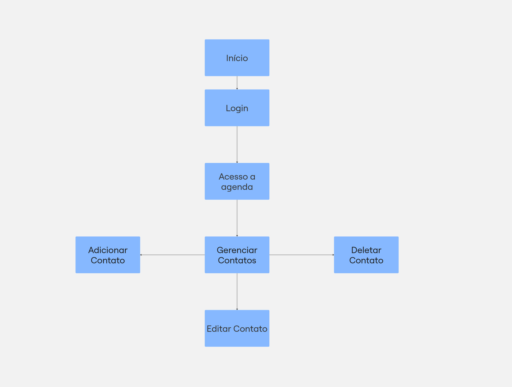
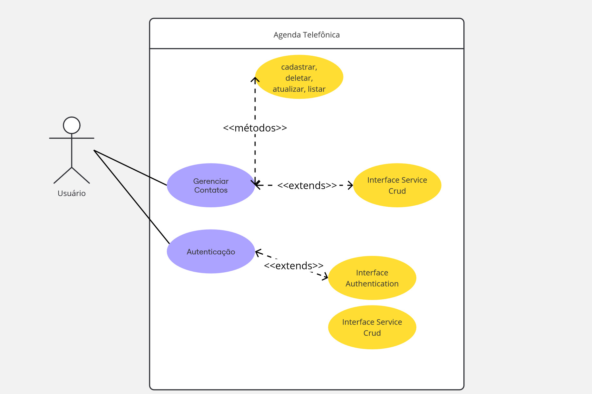
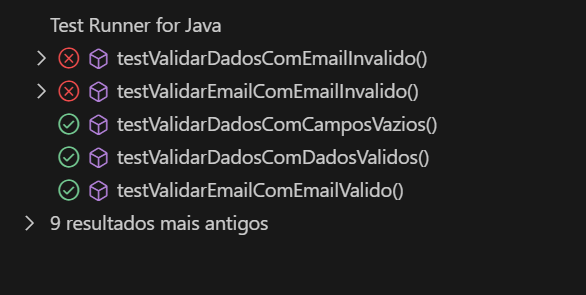

# Sistema de Agenda Telefônica

## Descrição
O Sistema de Agenda Telefônica é uma aplicação desenvolvida em Java que utiliza a biblioteca Java Swing para oferecer uma interface gráfica intuitiva e amigável. O sistema tem como principal objetivo permitir o gerenciamento eficiente de contatos, oferecendo funcionalidades que facilitam o cadastro, edição, exclusão e listagem de informações de contato.

### Características do Sistema
- **Interface Gráfica Intuitiva**: Desenvolvida com Java Swing, a interface é fácil de usar, permitindo que os usuários naveguem rapidamente entre as funcionalidades.
- **Gerenciamento de Contatos**: O sistema permite o cadastro de novos contatos, a edição das informações existentes e a exclusão de contatos que não são mais necessários.
- **Listagem de Contatos**: Os usuários podem visualizar todos os contatos cadastrados em uma lista organizada, com a possibilidade de buscar por critérios específicos.
- **Segurança**: O acesso ao sistema é controlado por meio de login e senha, garantindo que apenas usuários autorizados possam acessar as informações.

## Escopo do Sistema
- Cadastro de contatos
- Edição de contatos
- Exclusão de contatos
- Listagem de contatos
- Interface gráfica para interação com o sistema
- Login e senha para acesso ao sistema

## 1. Contato

- **Atributos**
    - `id`: Integer (PK) - Identificador único do contato.
    - `nome`: String - Nome completo do contato.
    - `telefone`: String - Número de telefone do contato.
    - `email`: String - Email do contato.
    - `cpf`: String - CPF do contato.
    - `data`: String - Data em que o contato foi adicionado.

- **Métodos**
    - `getNome_contato()`: Retorna o nome do contato.
    - `getTelefone_contato()`: Retorna o telefone do contato.
    - `getEmail_contato()`: Retorna o email do contato.
    - `getImage_perfil()`: Retorna o caminho da imagem de perfil do contato.
    - `getImage_fundo()`: Retorna o caminho da imagem de fundo do contato.

## Diagrama de Uso

  

    
  

## Diagrama de Fluxo
    

     

# Manual do Usuário - App Agenda de Contatos

## Introdução
Bem-vindo ao manual do usuário da nossa App Agenda de Contatos! Esta aplicação permite que você gerencie seus contatos de forma simples e eficiente. Você pode adicionar, editar e deletar contatos facilmente.

## Requisitos do Sistema
- Sistema Operacional: Windows, macOS, Linux
- JVM/JRE/JDK/JAVA 21
- Postgres

## Acesso ao Sistema
Para acessar a aplicação, siga os passos abaixo:

1. **Inicie a aplicação**: Execute o arquivo principal (`main` ou equivalente).
2. **Tela de Login**:
   - **Email**: Insira `adm`.
   - **Senha**: Insira `adm`.
3. **Clique em 'Entrar'**: Você será redirecionado para a tela principal onde poderá gerenciar os contatos.

## Funcionalidades

### 1. Cadastrar Contatos
- Preencha os campos obrigatórios no formulário:
  - Nome
  - Email
  - Telefone
- Clique no botão **'Cadastrar'**.
- Uma mensagem de confirmação aparecerá indicando que o contato foi adicionado com sucesso.

### 2. Visualizar Contatos
- Todos os contatos cadastrados aparecerão em uma lista na tela principal.
- Você pode clicar em um contato na lista para selecioná-lo.

### 3. Editar Contatos
- Selecione um contato da lista.
- Preencha os campos do formulário com as novas informações desejadas.
- Clique no botão **'Editar'**.
- Uma mensagem de confirmação aparecerá indicando que as alterações foram salvas.

### 4. Deletar Contatos
- Selecione um contato da lista.
- Clique no botão **'Deletar'**.
- Confirme a exclusão quando solicitado.
- Uma mensagem de confirmação aparecerá indicando que o contato foi removido com sucesso.

## Dicas
- Certifique-se de que todos os campos obrigatórios estejam preenchidos antes de cadastrar ou editar um contato.
- Use a função de pesquisa, se disponível, para encontrar rapidamente um contato específico.

## Solução de Problemas
- **Não consigo fazer login**: Verifique se você está utilizando as credenciais corretas (Email: `adm`, Senha: `adm`).
- **Erro ao cadastrar/editar/deletar contatos**: Verifique se todos os campos obrigatórios estão preenchidos corretamente.

## Suporte
Para mais informações ou assistência, entre em contato com o suporte técnico pelo e-mail de contato.

---

Esperamos que você tenha uma experiência agradável utilizando nossa App Agenda de Contatos!

## Scripts SQL
``CREATE TABLE IF NOT EXISTS contatos (NOME VARCHAR (255), CPF VARCHAR(20) PRIMARY KEY, TELEFONE VARCHAR(255), EMAIL VARCHAR(255), DATA VARCHAR(255))``

## Testes unitarios
    

     

